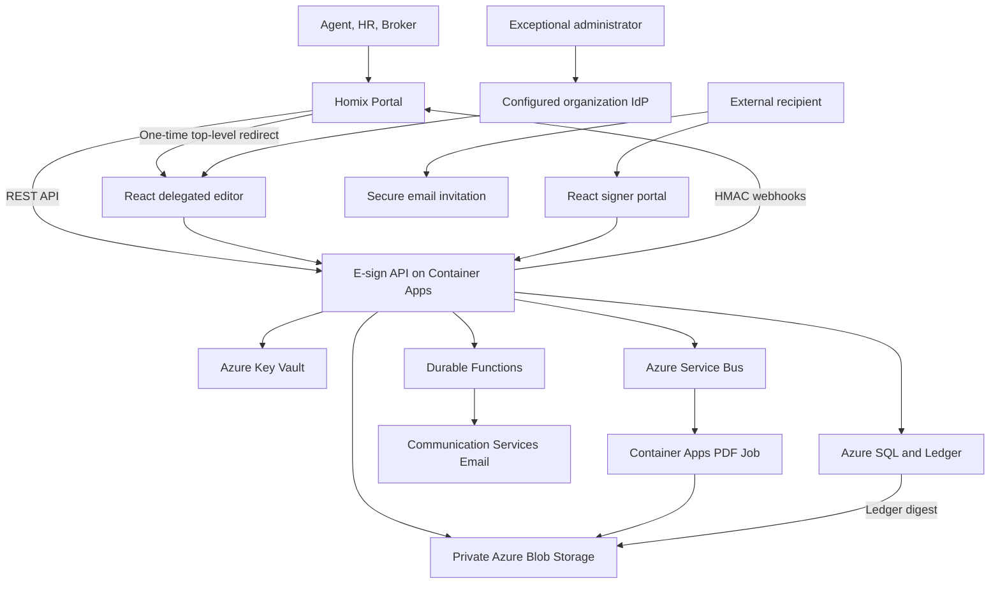

# Internal E-Sign Platform Plan

## 1. Executive Summary

Build a private, shared e-signature platform for the organization's own products. The platform will initially support:

- Licensed real-estate PDF workflows in New York, New Jersey, and California.
- Ordinary US employee onboarding documents.
- A visual drag-and-drop PDF field designer.
- Accountless external signing from one invitation email and one click.
- Staff initiate work in Homix Portal and enter eSign preparation/editor screens without a second login.
- Sequential and parallel recipients, reminders, deadlines, decline, void, correction, and completion.
- Immutable completed documents, completion certificates, tamper-evident audit history, retention, and legal holds.
- Versioned REST APIs and signed webhooks for existing and future internal projects.

Azure will be the system of record. Version one will use a modular TypeScript monorepo, Azure Container Apps, Durable Functions, Azure SQL with Ledger, private Blob Storage with immutable retention, Key Vault, Service Bus, Communication Services Email, a small standalone administrator identity provider, and Application Insights.

The platform is an internal shared service, not a public SaaS. External signers do not create an account. The normal assurance level is possession of a secure invitation delivered to the assigned email address; the evidence report will describe that fact accurately and will not claim government identity verification.

## 2. Decisions Already Made

| Area                              | Decision                                                                        |
| --------------------------------- | ------------------------------------------------------------------------------- |
| Cloud platform                    | Azure, without a cross-cloud runtime in v1                                      |
| Initial jurisdictions             | NY, NJ, CA                                                                      |
| Initial business domains          | Real estate and ordinary HR onboarding                                          |
| External recipient authentication | Single secure email invitation link by default                                  |
| Enhanced authentication           | Optional separately communicated access code                                    |
| Normal staff entry                | Homix Portal delegated session; no second eSign login                           |
| Standalone administrator          | Exceptional access only; Google Workspace preferred at deployment gate          |
| Source documents                  | Private PDFs for which the organization already has legal authorization         |
| Template authoring                | Visual drag/drop field placement with immutable template versions               |
| Integration model                 | Portal-first `/v1` API plus one-time editor redirects and HMAC webhooks         |
| Completed real-estate retention   | Default seven years, pending final broker/counsel approval                      |
| Specialized forms                 | I-9, W-4, tax, medical, notarization, KBA, and government ID excluded from v1   |
| Public product features           | Signup, billing, marketplace forms, and external tenant administration excluded |

## 3. Product Outcomes and Success Criteria

### 3.1 Required outcomes

- One staff member can upload a licensed PDF, define signer roles, drag fields onto pages, publish a template version, and create an envelope.
- One real-estate agent can prepare an offer or listing agreement, optionally obtain broker approval, and send it to multiple parties.
- One HR preparer can assemble an onboarding packet, prefill approved employee information, collect employee fields/signature, and route to an employer countersigner.
- An external recipient can open one invitation email, select **Review & Sign**, accept the electronic-record disclosure, complete assigned fields, and finish without creating an account or receiving a second verification email.
- The system does not announce completion until it has produced and verified the completed PDF and evidence package.
- Existing projects can create and track envelopes through a stable API and process signed, replay-safe webhooks.
- An authorized auditor can verify hashes, manifest signature, audit chain, SQL Ledger digest, object completeness, and retention state.

### 3.2 Pilot metrics

- At least 95% of valid invitations are accepted without support intervention.
- No invitation is consumed by a mail-security scanner GET request.
- No duplicate envelope, recipient, email, workflow action, final PDF, or webhook business action is created by retries.
- All completed pilot envelopes produce a valid evidence package.
- Zero cross-workspace access in automated and manual security testing.
- Zero secrets, invitation credentials, document contents, signature images, or sensitive field values detected in ordinary telemetry.
- Critical signer flows meet WCAG 2.2 AA and pass supported mobile-browser testing.
- Recovery exercises demonstrate the approved RPO/RTO and verify sampled evidence after restore.

## 4. Users and Roles

| Role                    | Primary abilities                                                                           |
| ----------------------- | ------------------------------------------------------------------------------------------- |
| Platform administrator  | Platform configuration and controlled, audited support access                               |
| Workspace administrator | Members, templates, policies, clients, and webhook configuration for one workspace          |
| Preparer                | Create transactions/packets, prepare documents, assign recipients, and send when allowed    |
| Approver/Broker         | Approve or reject prepared envelopes before external delivery                               |
| Auditor                 | Read historical records, evidence, retention, and verification results                      |
| Application client      | Perform only explicitly scoped API operations for one environment/workspace                 |
| External signer         | Review and edit only assigned fields, sign, decline, and retrieve entitled completed copies |
| Countersigner           | Sign after an earlier recipient or group completes                                          |
| View/copy recipient     | Review or receive final copies without modifying signer fields                              |

Authorization is deny-by-default. Every record and Blob object is workspace-scoped. Platform support access requires a reason, short expiration, visible support-mode indicator, and immutable audit trail.

## 5. Scope

### 5.1 Version-one features

- Workspaces, members, roles, scoped application clients, and staff SSO.
- Private PDF upload, quarantine, malware/compatibility checks, and licensed-source metadata.
- Template list, draft, visual editing, preview, validation, publication, cloning, versioning, and retirement.
- Multi-document packets and per-document retention classification.
- Field types: signature, initials, signed date, name, email, title/company, text, multiline, number, currency, address, phone, checkbox, radio, dropdown, attachment, and read-only merge value.
- Recipient roles and parallel/sequential routing groups.
- Envelope preparation, approval, send, reminder, resume, decline, void, expiration, correction, and supersession.
- Typed and drawn signatures/initials with explicit intent and accessible alternatives.
- One-email remote signing with scanner-safe secure invitations.
- Optional separately communicated access code.
- Completion PDF, completion certificate, canonical manifest, audit JSONL, Key Vault manifest signature, and SQL Ledger evidence.
- WORM retention, legal holds, verification, secure downloads, and evidence exports.
- NY/NJ/CA real-estate transaction folders and versioned capability packs.
- Ordinary HR onboarding packets and employer countersigning.
- `/v1` REST API, idempotency, external references, signed webhooks, retry, dead letter, and replay.
- Monitoring, alerts, backup, restore exercises, key rotation, privacy controls, and operational runbooks.

### 5.2 Explicitly out of scope

- Public SaaS signup, subscriptions, billing, reseller features, or third-party workspace administration.
- Redistribution of licensed association forms to users without the organization's rights.
- Remote online notarization, deeds, mortgage closing, e-recording, digital certificates, PAdES, or qualified electronic signatures.
- I-9, W-4, tax returns, benefits/medical forms, KBA, biometric checks, or government ID verification.
- Word/Excel conversion, OCR signature-line detection, AI legal drafting, real-time collaborative editing, native mobile apps, or offline signing.

## 6. Primary User Journeys

### 6.1 Template authoring

1. Authorized staff uploads one or more licensed PDFs.
2. The platform quarantines, scans, parses, hashes, and classifies compatibility.
3. The editor supplies license/source, jurisdiction, edition, effective date, document class, and retention policy.
4. The editor defines roles and routing defaults.
5. The editor drags fields onto PDF.js-rendered pages and assigns validation and role ownership.
6. The editor previews each recipient role and resolves validation errors.
7. Publishing creates an immutable template version; subsequent edits create a new version.

### 6.2 Real-estate envelope

1. Agent creates or opens a property transaction.
2. Agent chooses the approved NY, NJ, or CA template edition.
3. Source-project/property data prefill approved merge fields.
4. Agent assigns buyers, sellers, co-owners/entity signatories, broker, and copy recipients.
5. Agent confirms routing, deadlines, reminders, and assurance method.
6. Required broker approval occurs before external delivery.
7. Recipients sign in parallel or sequence.
8. Finalization produces immutable evidence and then sends completion copies.
9. Counteroffers, amendments, and corrections become linked envelopes and never rewrite the original.

### 6.3 HR onboarding packet

1. HR selects an approved packet containing ordinary onboarding documents.
2. HR supplies employee merge values and recipients.
3. Employee opens one invitation and completes all assigned documents.
4. Organization countersigner becomes active after employee completion.
5. Sensitive packages are delivered through secure links rather than email attachments.
6. Each document retains its own approved retention class.

### 6.4 External signing

1. Recipient receives one branded invitation email.
2. Recipient selects **Review & Sign**.
3. The signer portal exchanges the invitation for a bounded browser session; no second OTP is sent.
4. Recipient reviews/downloads the document and accepts the versioned electronic-record disclosure.
5. Recipient completes assigned fields and adopts a typed or drawn signature.
6. Recipient explicitly selects **Finish**.
7. The next routing group activates or finalization starts.
8. Recipient receives a completion notification and entitled copy/link after evidence commit.

## 7. Recipient Access and Assurance

### 7.1 Default email invitation

- At least 256 bits of cryptographic randomness.
- Bound to exactly one envelope and recipient.
- Only a protected hash stored in the database.
- Expires with the envelope.
- Revoked on recipient replacement or envelope void.
- Becomes non-mutating after completion.
- Safe GET requests never consume the invitation or record consent/signature.
- Mutations require a bounded HttpOnly, Secure, SameSite session and CSRF protection.
- Credential-bearing paths and query values are excluded or redacted from logs.

### 7.2 Assurance labels

| Method           | Evidence description                                      |
| ---------------- | --------------------------------------------------------- |
| Email invitation | Secure invitation delivered to assigned recipient email   |
| Access code      | Email invitation plus separately communicated access code |
| Portal session   | Portal-authenticated actor delegated by a registered app  |
| Admin account    | Authenticated standalone administrator account            |

The system never describes email-invitation possession as government identity verification. Shared email addresses are allowed with distinct recipient links, but the preparer receives a warning that one mailbox cannot distinguish natural persons.

## 8. Architecture



### 8.1 Deployable units

- `web`: React/TypeScript delegated editor, exceptional administrator console, and signer portal.
- `api`: Node.js/TypeScript modular-monolith API.
- `workflows`: Durable Functions for approval, routing, reminders, deadlines, and completion.
- `pdf-finalizer`: Queue-triggered container job with pinned PDF tools and fonts.
- `infra`: Azure infrastructure as code, environment configuration, policies, dashboards, and alerts.

### 8.2 Azure resources

- Container Apps and Container Apps Jobs.
- Azure Functions/Durable Functions.
- Azure SQL Database with append-only Ledger tables.
- Private Blob Storage containers/accounts for quarantine, drafts, templates, in-progress documents, completed documents, evidence, and recovery.
- Service Bus queues and dead-letter queues.
- Key Vault with managed identities and manifest-signing keys.
- Communication Services Email with custom verified domain and SPF/DKIM.
- Configured standalone administrator identity provider; normal Portal users require no eSign IdP login.
- Application Insights, Log Analytics, alert groups, and budgets.

Development, staging, and production use separate identities, data stores, storage, Key Vaults, email resources, and app registrations. Staging identities cannot access production data or secrets.

## 9. Core Data Model

| Aggregate          | Principal records                                                                                    |
| ------------------ | ---------------------------------------------------------------------------------------------------- |
| Access             | `workspaces`, `workspace_members`, `application_clients`, `portal_launch_sessions`, `staff_sessions` |
| Templates          | `templates`, `template_versions`, `template_documents`, `recipient_roles`, `template_fields`         |
| Business folders   | `transactions`                                                                                       |
| Signing            | `envelopes`, `envelope_documents`, `recipients`, `routing_groups`, `field_values`                    |
| Recipient evidence | `recipient_sessions`, `consent_records`, `signature_adoptions`                                       |
| Audit and evidence | `audit_events`, `evidence_packages`, `retention_policies`, `legal_holds`                             |
| Communications     | `email_deliveries`, `webhook_subscriptions`, `webhook_events`, `webhook_deliveries`                  |

Operational rows use optimistic concurrency. Evidence-critical events use append-only Ledger tables and a canonical previous-event hash. Database models are not exposed directly as API schemas.

## 10. State and Routing Model

```text
DRAFT
  → PREPARED
  → APPROVAL_PENDING (optional)
  → READY_TO_SEND
  → SENT
  → IN_PROGRESS
  → FINALIZING
  → COMPLETED

Side/terminal states:
DECLINED, VOIDED, EXPIRED, FAILED_FINALIZATION
```

Rules:

- Sending freezes document, field-schema, recipient, routing, disclosure, and policy versions.
- Post-send material changes require void/correction/supersession.
- Parallel recipients may act independently inside a routing group.
- The next routing group activates only when all required active recipients in the prior group finish.
- Recipient completion requires all assigned required fields and an explicit Finish action.
- Envelope completion occurs only after verified evidence commit.
- Commands and workflow/queue handlers are idempotent.

## 11. Template Coordinate and PDF Strategy

- PDF.js renders pages in the browser.
- Fields are stored with page-relative normalized coordinates plus page rotation and crop-box context.
- Browser zoom and device-pixel ratio never change stored coordinates.
- The editor supports multi-select, alignment, equal spacing, copy-to-page, and initials-on-all-pages.
- Upload classification rejects encrypted, corrupt, malicious, unsupported XFA, or otherwise non-finalizable PDFs before sending.
- The finalizer validates source hashes, renders/flattens appearances, appends a completion certificate, verifies output readability/page count, and hashes final bytes.
- Temporary outputs remain mutable; only verified final objects receive immutable retention.
- The project maintains a golden PDF corpus for rotations, crop boxes, AcroForms, fonts, large pages, malformed inputs, and retry behavior.

## 12. Evidence and Retention

Each completed envelope produces:

- Original source PDF(s).
- Frozen sent-version hashes.
- Completed flattened PDF(s).
- Completion certificate.
- Canonical manifest with every file SHA-256.
- Audit history in JSONL.
- Consent/disclosure version and acceptance.
- Recipient assurance method and event timestamps.
- Server-observed IP and user agent.
- Relevant invitation/reminder/completion delivery events.
- Key Vault signature over the canonical manifest.
- SQL Ledger digest references.

Completed real-estate packages default to seven-year immutable retention, subject to final policy approval. Legal holds do not shorten time retention. HR retention is document-specific. Drafts and expired operational data are cleaned according to separate policy and never inherit completed-evidence WORM rules accidentally.

Verification checks file hashes, manifest signature, audit chain, SQL Ledger digest, object completeness, and retention/hold state.

## 13. API and Event Boundary

Initial REST resources:

- `/v1/workspaces`
- `/v1/transactions`
- `/v1/templates`
- `/v1/envelopes`
- `/v1/envelopes/{id}/send`
- `/v1/envelopes/{id}/void`
- `/v1/envelopes/{id}/resend`
- `/v1/envelopes/{id}/documents`
- `/v1/envelopes/{id}/evidence`
- `/v1/application-clients`
- `/v1/webhook-subscriptions`

API requirements:

- Environment/workspace/operation-scoped client credentials.
- Idempotency keys for repeat-prone writes.
- Workspace-unique external references.
- Safe validation errors, request IDs, and correlation IDs.
- Cursor pagination.
- Bounded authorized document downloads without public Blob credentials.

Webhook requirements:

- Versioned events and unique event/delivery IDs.
- HMAC signature over timestamp plus exact raw body.
- Timestamp tolerance and consumer event-ID deduplication.
- Persisted attempts, bounded exponential retry, terminal dead letter, and controlled replay.
- Reference consumer proving correct signature verification and deduplication.

## 14. Security and Privacy Gates

- TLS for every external and internal connection.
- Managed identities instead of connection strings wherever supported.
- Key Vault RBAC, purge protection, rotation, and no private key in source/configuration.
- Workspace isolation tests for every record and object type.
- Quarantine, MIME detection, structural PDF parsing, malware scan, size/count limits, and parser resource limits.
- No arbitrary server-side document URL import.
- Webhook destination controls preventing private-network SSRF.
- Secure cookies, CSRF, strict CORS, CSP, frame blocking, rate limits, input validation, safe redirects, and encoded output.
- No invitation secret, session token, API key, PDF content, signature image, field value, SSN, or bank value in ordinary logs.
- Just-in-time privileged access and audited configuration/export/restore/hold/deployment actions.
- CI secret scanning, dependency review, SAST, container scan, IaC checks, and signed artifacts.
- Threat model, privacy review, independent security review, and blocking-finding remediation before production pilot.

## 15. Delivery Phases and Exit Criteria

### Phase 0: Governance and pilot definition

Deliverables:

- Named owners.
- Final v1 scope and non-goals.
- Broker/counsel review path.
- HR document and retention matrix.
- Production brand/domain decision.
- Pilot state templates and HR packet selected.

Exit: No unresolved owner or policy decision blocks technical implementation.

### Phase 1: Engineering and Azure foundation

Deliverables:

- TypeScript monorepo and CI gates.
- Isolated Azure environments and IaC.
- Managed identities, Entra, SQL, Blob, Service Bus, Key Vault, email, monitoring, and budgets.
- Synthetic development fixtures.

Exit: Staging deploys repeatably and cannot access production resources.

### Phase 2: Template vertical slice

Deliverables:

- Secure upload and PDF compatibility classification.
- PDF.js template editor.
- Role assignment, drag/drop fields, validation, preview, packets, publication, and retirement.

Exit: A synthetic multi-page rotated PDF template retains accurate coordinates across supported browsers and zoom levels.

### Phase 3: Remote signing vertical slice

Deliverables:

- Envelope state machine and preparation UI.
- Approval, recipient routing, send, scanner-safe invitation, consent, field entry, signature adoption, resume, finish, decline, void, and expiration.
- Durable routing, email, reminders, and deadlines.

Exit: A mobile recipient completes a sequential/parallel synthetic envelope from one invitation email; scanner prefetch and retries cannot corrupt it.

### Phase 4: Evidence and retention

Deliverables:

- Containerized deterministic PDF finalizer.
- Completion certificate, manifest, audit JSONL, Key Vault signature, SQL Ledger digests.
- Immutable Blob retention, legal holds, failed-finalization recovery, and package verification.

Exit: Every golden test envelope produces a reproducible, verifiable evidence package and resists early deletion.

### Phase 5: API and source-project integration

Deliverables:

- `/v1` OpenAPI contract.
- Scoped clients, idempotency, external references, downloads.
- Exact-return-URL Portal clients, five-minute one-time launches, bounded HttpOnly staff sessions, dual actor/application audit attribution, and Portal return navigation.
- Signed webhook delivery, retry, dead letter, replay, and reference consumer.

Exit: Homix Portal creates, prepares, tracks, completes, and retrieves an envelope without a second staff login or duplicate effects under retries.

### Phase 6: Real-estate and HR packs

Deliverables:

- Versioned NY/NJ/CA packs.
- Transaction chains, role presets, broker approval, deadlines, initials, license/edition governance, seven-year mapping.
- Ordinary HR packet, countersignature, per-document retention, specialized-form guards, secure completion delivery.

Exit: Broker/counsel and HR owners accept documented scenarios using synthetic data.

### Phase 7: Hardening and pilot

Deliverables:

- Requirements-to-tests traceability.
- Security/privacy reviews.
- WCAG 2.2 AA validation.
- Browser/mobile/PDF corpus/load/concurrency/outage tests.
- Dashboards, alerts, runbooks, backup/restore, ledger verification, incident process.
- Synthetic production smoke test and controlled pilot.

Exit: All release gates are signed, all blocking findings are resolved, and pilot metrics meet agreed thresholds.

### Phase 8: Controlled expansion

Deliverables:

- Additional licensed template versions.
- Additional internal project integrations.
- Production support and usage/cost reviews.

Exit: Expansion proceeds by batch with explicit rollback criteria and no change to historical evidence.

## 16. Test Strategy

- Unit tests for domain state, policy, canonicalization, hashes, coordinates, and validators.
- Database migration and constraint tests.
- API and webhook schema/contract tests.
- Integration tests with SQL, Blob, Key Vault signing, queues, workflows, email fakes, and PDF tools.
- Browser tests for staff authoring and signer flows.
- Mobile Safari/Chrome and current desktop Chrome/Safari/Firefox/Edge.
- Screen-reader and keyboard manual validation plus automated accessibility tests.
- Mail-scanner GET/prefetch tests.
- Retry, duplicate, concurrency, workflow replay, queue redelivery, and partial-outage tests.
- PDF golden files, malformed file tests, and parser fuzzing.
- Cross-workspace/IDOR, CSRF, XSS, injection, redirect, SSRF, upload, and credential-leak tests.
- Load tests for invitation open, autosave, send, PDF finalization, webhook delivery, and evidence retrieval.
- Restore exercises and post-restore evidence verification.

Every normative scenario in the OpenSpec capability files must map to at least one automated or documented manual acceptance test.

## 17. Operations

Required dashboards and alerts:

- API availability, latency, errors, and throttling.
- Staff and recipient authentication failures.
- Invitation delivery and bounce.
- Queue backlog and oldest-message age.
- Durable workflow age/failure.
- PDF finalization latency/failure.
- Webhook dead letters.
- SQL, Blob, Key Vault, Service Bus, email, and Container Apps availability.
- Ledger and evidence verification failures.
- Abnormal invitation attempts and privileged support access.
- Spend and quota thresholds.

Required runbooks:

- Recipient replacement and resend.
- Void, correction, and supersession.
- Failed finalization recovery.
- Webhook replay.
- Email outage.
- Key/credential rotation.
- Legal hold and evidence export.
- Database/evidence restore.
- Integrity mismatch investigation.
- Security incident and customer/broker communication.

## 18. Cost Posture

The project will optimize for defensibility and operational simplicity before minimum infrastructure cost. Expected cost drivers are Azure SQL, monitoring retention, email, Blob versions/retention, and any always-on compute. Container Apps and workflow components should scale to zero where this does not harm signer experience.

Controls:

- Separate budget and quota alerts per environment.
- Explicit max replicas, CPU/memory limits, request limits, email quotas, and queue bounds.
- Short non-production log and draft retention.
- No production forms or PII in ephemeral test environments.
- Monthly cost review during pilot.
- Revisit service tiers after real invitation, PDF, and API usage is measured.

## 19. Remaining Decisions

These decisions are required before production but do not block initial engineering:

- Final production region and disaster-recovery region/timing.
- Final hostname and sender domain.
- Named NY/NJ/CA broker/counsel approvers.
- Final real-estate and HR retention matrix.
- Whether non-sensitive completed real-estate PDFs are attached to email or always delivered by secure link.
- Final Homix Portal staging/production return URLs and stable actor-subject format.
- Google Workspace versus Entra for the small exceptional administrator group (Google preferred).
- Pilot and general-availability RPO/RTO.

## 20. Detailed Artifact Index

- [OpenSpec proposal](openspec/changes/build-internal-esign-platform/proposal.md)
- [Technical design](openspec/changes/build-internal-esign-platform/design.md)
- [Implementation checklist](openspec/changes/build-internal-esign-platform/tasks.md)
- [Workspace access specification](openspec/changes/build-internal-esign-platform/specs/workspace-access/spec.md)
- [PDF template authoring specification](openspec/changes/build-internal-esign-platform/specs/pdf-template-authoring/spec.md)
- [Envelope signing specification](openspec/changes/build-internal-esign-platform/specs/envelope-signing/spec.md)
- [Recipient email access specification](openspec/changes/build-internal-esign-platform/specs/recipient-email-access/spec.md)
- [Evidence and retention specification](openspec/changes/build-internal-esign-platform/specs/evidence-retention/spec.md)
- [Real-estate workflows specification](openspec/changes/build-internal-esign-platform/specs/real-estate-workflows/spec.md)
- [HR onboarding specification](openspec/changes/build-internal-esign-platform/specs/hr-onboarding/spec.md)
- [Integration API and webhooks specification](openspec/changes/build-internal-esign-platform/specs/integration-api-webhooks/spec.md)
- [Security, privacy, and operations specification](openspec/changes/build-internal-esign-platform/specs/security-privacy-operations/spec.md)

The OpenSpec change is named `build-internal-esign-platform` and is ready for implementation once the Phase 0 ownership/policy gates needed for the selected vertical slice are satisfied.
