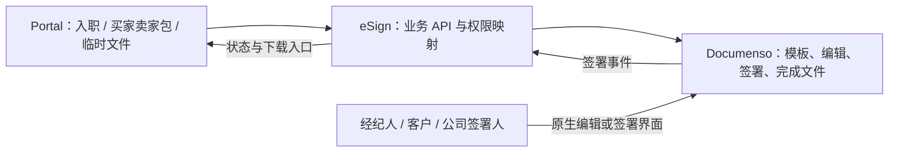

# Documenso + Portal：eSign 目标对齐与实施计划

日期：2026-09-12

> 2026-09-13 范围更新：标准 buyer/seller/Listing 包改为公司持有，不需要经纪人原生账号；个人上传与原生编辑延后。第一阶段实现及当前边界以 [COMPANY_PACKAGES.md](COMPANY_PACKAGES.md) 为准，下文保留先前方案的历史背景。

状态：已完成 Documenso 集成、两仓库 GitHub PR/CI 合并及正式站上线验证；旧签署 API 已停用、旧 PDF 自动触发已关闭，50 项旧 Portal 签署配置已移除。公司正式买卖文件及逐人原生账号连接按业务配置补充。
核对基线：eSign `1d3e1bd`，Portal `a02c539`。

## 1. 产品定义

Kevv eSign 是公司基于 Documenso 的签署工具和 Portal API 服务。Documenso 是唯一电子签署引擎与电子签署记录的权威来源。Portal 独立记录线下合同核验、收款事实、既有人员认定和例外授权。Portal 是员工日常业务入口。eSign 只补两者之间确实需要的公司业务配置、身份与权限映射、接口及同步。

用户明确的三个场景：

1. 经纪人入职相关的一系列合同。
2. 经纪人一键准备并发送买家、卖家签署 package。
3. 经纪人偶尔上传个性化文件，使用 Documenso 的编辑和签署能力。

用户明确取消旧待签合同的兼容要求：当前一两名待入职者不构成切换约束，不设计 native 双引擎、不迁移他们的草稿和签署会话、不要求旧签署 URL 继续工作。本决定不等于要求删除业务账号、合同原文件或历史存储；数据清理不是本次目标。

本计划和 ADR 0002 替代旧 `PLAN.md` / `build-internal-esign-platform` 中自建通用签署平台的目标。旧文档只作历史记录，不能再作为新增 native 功能的依据。

## 2. 最终职责

| 层        | 保留的职责                                                                                                 | 权威数据                                       |
| --------- | ---------------------------------------------------------------------------------------------------------- | ---------------------------------------------- |
| Portal    | 登录后的入职引导、文件签署工作台、管理员入职工作台、业务资料、线下合同核验、收款、审批与例外权限           | 经纪人、交易业务、付款、人工核验和实际访问权限 |
| eSign API | 调用方鉴权、公司签署包配置、角色及预填数据映射、所有权检查、幂等发起、签署入口、回调接收与业务同步         | 业务关联、包版本、映射、同步记录               |
| Documenso | 文档及模板编辑、签署人交互、保存恢复、签署顺序、邀请和催签、签署完成、PDF 数字签章、签署审计与完成文件分发 | 合同文件、签署人状态、完成 PDF、签署审计       |

eSign 不维护第二套可编辑 PDF 模板和字段设计器。包配置可以引用 Documenso 模板、角色键、字段键和已发布版本指纹；这属于业务配置，不是重写模板系统。

## 3. 三个用户流程与入口

### 入口分工

| 谁 / 场景              | 入口                                              | 自动或手动                           | 用户看到的工作                             |
| ---------------------- | ------------------------------------------------- | ------------------------------------ | ------------------------------------------ |
| 新经纪人入职           | 登录后由 Portal 识别并进入现有入职页面 `/pending` | 自动展示当前步骤；资料确认后准备合同 | 完善资料、继续签约、付款、查看办理状态     |
| 已开通经纪人的客户签署 | Portal 工作台固定入口“文件签署”，建议 `/signing`  | 用户主动发起                         | 买家包、卖家包、个性化文件、自己的任务列表 |
| 管理员处理入职         | `/admin/agents?view=onboarding` → “处理入职”      | 管理员处理待办                       | 签约、收款、开通、公司会签、线下合同及例外 |

入职不是让新人先进入通用文件签署工作台再自己找模板；也不是每次登录强行弹一个新签约窗口。系统根据服务端状态自动显示入职下一步，用户点击继续时打开同一份合同。入职仍处在资料准备阶段时，不因登录或刷新重复创建合同、发送邀请。

已开通账号进入正常 Portal 工作台；存在公司会签待办不把本人重新送回新入职流程。例外开放账号按允许能力进入有限工作台，同时持续显示补签事项。

### A. 登录后自动衔接入职合同

Portal 根据经纪人所属法律实体、角色与计划，选择发布的入职签署包，预填现有资料。包可包含多份文件，各文件定义适用签署角色、顺序和必填信息。

登录后复用已有经纪人身份和当前入职任务，按资料、合同、付款、待处理结果恢复位置。资料确认到可签状态后准备匹配的合同包，展示“继续签署”，由本人进入 Documenso。签署退出、换设备或返回 Portal，仍恢复同一份有效任务；合同终止或过期时显示明确的处理动作。

经纪人本人能在入职页查看合同和当前进度。管理员在现有入职处理面板看到缺什么、谁需要操作、是否已付款、是否待公司签署，能够查看原文和完成文件、重发邀请。已核验纸质或历史合同的人不再被强制要求完成一份等价电子合同。

签署事实来自 Documenso 服务端状态及回调，不由浏览器“签完了”回跳参数决定。保持用户已经确定的业务规则：

- 线上：资料完成 → 本人签署 → Stripe 付款 → 自动开通。
- 线下常规流程：资料完成 → 本人签署 → 管理员核验收款 → 管理员审批开通。
- 实际收款事实可以在签约前记录；是否满足入职开通条件单独计算，不能为了登记已收到的钱先虚构签约状态。
- 纸质/历史合同核验是独立合同来源。线上付款与线下审批的处理均读取合同要求满足情况，不再只检查电子签署时间戳。
- “经纪人已签”“所有必需签署人均完成”“账号已开通”是三个不同状态；公司补签仍需要可见待办，不改写为经纪人代签，也不因切换引擎而暗改开通规则。

HR 合同与客户合同在 Documenso 权限空间中分离。普通经纪人不可通过原生 Documenso 页面看到其他人的入职资料。

### B. 买家 / 卖家签署 package

Portal 工作台的“文件签署”入口是固定业务工作台，建议路由 `/signing`。它包含“发起买家包”“发起卖家包”“上传文件发起签署”三个主操作，以及统一任务列表。

列表按“待我处理、草稿、待他人签署、已完成、异常/过期”筛选，可搜索客户、房产或文件名；每行显示文件/包名、关联客户/房产、逐人进度、最后更新时间及明确的下一步。详情页展示文件、签署人、时间线及原件/完成件下载。关闭编辑或从 Documenso 返回后保留列表筛选与任务位置。

经纪人从关联业务或手动填写房产/客户资料，选择实际买家、卖家、共同签署人及其他收件角色。工作台查看本人有权限的客户文档，个人入职合同继续在入职/个人资料中查看，HR 管理不混入客户文档列表。

eSign 自动选择公司发布的包版本，展开文件、匹配签署角色并预填一次资料。经纪人确认文件清单、收件人、字段和顺序后发送。相同收件及可见范围的多份文件优先使用一个 Documenso envelope，减少客户反复打开多个独立邀请。

“一键”指减少重复选文件、填资料、放字段和发起任务；客户仍亲自确认和签署。不可将不同客户的私密文件合到同一个可见包。若包内文件的收件范围或签署时机不同，明确拆成关联子任务，由 eSign 汇总完成情况，不自建逐人签署引擎。

签完后，Documenso 负责完成文件与分发；Portal 显示包的进度，并允许被授权的经纪人下载。模板内容由公司提供和选定，不能凭代码猜测一套“通用买家包/卖家包”中的法律文件。

### C. 临时 / 个性化文件

Portal 文件签署工作台提供“上传文件发起签署”，进入 Documenso 原生上传和编辑流程。经纪人使用其现成能力放置签名、日期和其他字段、添加收件人并发送。该文档默认只属于本人及公司授权管理员。

默认优先采用原生 Documenso 页面，允许在新页完成编辑后返回 Portal。首期不以完全嵌入或隐藏 Documenso 品牌为上线前提。若采用嵌入编辑，先确认所选自托管版本的商业授权及真实权限机制，不为规避授权重写编辑器。

必须证明原生创建的文档能准确关联回 Portal 的经纪人和业务对象；不是只给一个跳到 Documenso 首页的链接。

### D. 管理员入职工作台（本轮必交付范围）

这部分是 Portal 的入职业务能力，与更换 Documenso 同属本计划，不是引擎上线后的另一个待定项目。

#### 已有基础与本轮增量

以 Portal `a02c539` 为基线，已有“处理入职”面板、步骤与下一操作、可见的审批条件、账号开通后的公司会签待办；普通编辑接口也已经拒绝 pending → active。这些要保留并回归，截图中的旧绕过问题不能再次描述成尚未修复的现状。

本轮新增线下合同核验、既有人员认定、限定权限的例外开放；重构仍与签约绑定的线下收款记录。当前 `onboardingWorkflow.canRecordPayment` 与 `/api/onboarding/payments/offline` 都要求本人已签，且收款直接进入套餐结算，单独解锁按钮不足以完成改造。

#### 列表与任务统计

- 延续管理员 → 经纪人 → 入职待办 → 处理入职，不另建一个散落的审批系统。
- 默认按未完成事项查询所有相关账号，而不是只查 `accountStatus=pending`。已开通但公司未会签、合同待核验、例外待补签、收款待匹配者仍出现。
- 主列表按人员去重，页签显示“待处理人数”；筛选项和详情显示事项数，避免一个人同时缺合同和收款时统计混淆。
- 每人显示当前账号状态、卡在哪一步、下一责任人及动作。优先呈现已逾期、待管理员动作和最早待办时间，支持搜索、过滤与 URL 保留。
- 筛选至少覆盖待完善资料、待本人签署、签约异常、线下合同待核验、待付款/收款待匹配、可审批、待公司会签、例外待补齐/已到期。
- “忽略”改为有原因、可恢复的“暂不处理/关闭本次入职”，保留记录。不能靠隐藏一行清除合同、已收款或例外待办。

#### 处理面板

顶部显示“当前卡点 + 下一步 + 责任人”；资料、合同、收款、账号权限独立显示状态，下面共享事件时间线。各区可独立操作，未满足条件的动作显示具体原因。

- 资料：缺失信息、所属公司、经纪人角色、团队/条款，继续复用现有资料编辑。
- 合同：原件、来源、版本、本人和公司签署状态、继续/重发/检查状态、登记线下合同、核验或退回。
- 收款：实际收到的金额、币种、方式、日期、凭据、记录人、应付项目匹配状态，不受本人是否电子签署影响。
- 账号：标准开通资格、既有人员开通、例外权限及期限；显示开通后的实际能力和仍未完成的事项。
- 日志：谁在什么时候上传、核验、登记收款、审批、例外开放、变更范围、延长或撤销；保存原因与前后状态。

#### 四种处理路径

| 路径                       | 操作                                                                           | 合同/付款/权限的真实结果                                                                       |
| -------------------------- | ------------------------------------------------------------------------------ | ---------------------------------------------------------------------------------------------- |
| 标准电子入职               | 系统准备合同 → 本人签 → 在线付款自动开通，或线下收款后管理员审批               | 电子签署来自 Documenso；付款独立记录；公司签署待办继续跟踪                                     |
| 不使用电子签署但已纸质签署 | 上传已签 PDF、登记签署日期/公司/用途/版本及已签角色 → 管理员核验或退回         | 显示“线下合同已核验”；只满足核验覆盖的合同要求，不写成 eSign 已完成；按付款与其他条件继续      |
| 已是公司经纪人，有历史合同 | 标记“既有人员”并核验实际合同、身份/公司、已有条款与财务适用情况 → 专用开通动作 | 不重复新入职签约、不自动产生一次新入职收费；费用若不适用单独说明，不伪造已支付；有缺项继续待办 |
| 未签署，先开放部分功能     | 管理员登记理由、允许能力、截止时间、待补要求及责任人 → 授予有限权限            | 显示“例外开放 · 待补合同”等真实状态；合同仍未签、钱仍按实际状态；不改成完整 active             |

“历史合同作为入职依据”是新产品需支持的业务方式，与“不兼容当前 native 待签任务”不同：前者要建设，后者不增加迁移工程。

#### 线下合同核验

- 上传和核验分开：已上传 ≠ 已核验。记录关联人员、法律实体、合同用途、版本/名称、签署日期、涉及文件和签署角色、核验人及时间、结果、备注。
- 文件放在私有存储，由服务端签发短期访问；复用存储能力但不直接复用只允许 active 且绑定交易的客户文件上传路由。关联必须由服务端绑定 HR 人员与访问权限。
- 核验可接受、退回或撤销；已核验文件不能原地替换，替换形成新版本并重新核验，保留历史。
- 核验只覆盖已确认的要求：例如纸质合同只有本人签名而公司签名仍缺失，公司会签待办继续存在。
- Portal 保存该人工核验事实，不调用 Documenso 伪造签署完成。选择线下处理时，明确取消不再使用的线上草稿/邀请；取消失败显示待处理，不偷偷继续重复催签。

#### 收款事实与开通资格分开

- 允许在本人未签、资料不全、团队条款待确认时记录真实已收款；金额、方式、日期和凭据必须准确。
- 能确定应付项目时按现有账务规则匹配；尚不能确定或金额不符时记录为“已收款 · 待匹配/待核对”，保留钱的事实，不能直接当成已足额支付。
- 收款记录、分配到应付项目、套餐/权益生效、推荐奖励结算与账号开通必须拆清，不能仅为了收款登记就提前启动套餐或发放奖励。匹配后沿用经过确认的现有财务规则，不在本计划中发明新佣金政策。
- 保持 Stripe 正常签后支付路径；重复回调、同一凭据重复登记、线上与线下同时到款要防重并显示待核对，不能重复开通或重复结算。
- 例外权限和既有人员认定不修改真实付款状态。费用不适用/历史已核对要记录依据，不能写一笔不存在的 Stripe 或线下付款。

#### 例外权限

- 首期能力采用明确白名单，建议范围为完善本人资料、培训学习、公司资源阅读；管理员勾选实际允许项并设置期限，不提供无边界“跳过所有条件”的开关。
- 客户签署包发送、管理他人资料、财务操作等不因例外开放自动获得。若日后需要扩大范围，要有独立能力定义与核验。
- `accountStatus` 不直接写为完整 active；独立保存例外记录及允许能力。页面和 API 共用 `effectiveAccess` 判断，校验当前状态、权限版本和服务端时间。
- 例外到期/撤销后，授权能力立即不再满足接口校验，不能等待后台任务或旧 JWT 过期。后台只负责补签待办和提醒。
- 有限工作台不被旧的“非 active 一律重定向 /pending”逻辑挡回去，也不能靠放开整个 `/api` 放行。中间层只允许必要路由进入，最终服务端仍检查真实能力。
- 正常完成入职后重新计算完整权限并结束例外；后来收到重复签署/付款事件不重复开通。结束/到期的例外不得撤销已经通过正规流程获得的完整权限。

#### 统一业务判断与数据范围

Portal 的合同来源和核验、支付事实、入职处理状态、实际权限是独立维度。可统一计算 `contractRequirements`、`paymentReadiness`、`activationEligibility`、`effectiveAccess` 与 `openTasks`，但不能将它们压成一个“通过/未通过”字段。

- 合同满足情况读取 Documenso 的逐人电子签署事实，或经过核验的线下/历史文件；例外授权不算合同已满足。
- 标准开通、既有人员开通、有限例外使用独立、可审计的命令，共享权限检查和并发保护。普通资料编辑继续禁止绕过开通规则。
- Stripe 回调、管理员审批、账号创建/导入、停用后恢复都要核对是否能绕过该规则，明确各自的合法路径；不用一个可以任意写状态的接口承担全部业务。
- 最小新增数据预计包括：线下合同文件及核验版本、既有人员认定、收款事实/项目匹配、例外权限记录、操作事件。实际迁移设计要复用现有财务账本及审计，不再建设通用 HR 引擎。
- 用户取消了旧待签的兼容要求，但这些新能力仍需要自身的 schema 迁移和验证；“没有旧合同迁移”不等于“完全没有数据库变更”。

## 4. 保留、改造与移除

| 当前代码 / 能力                                          | 处理                                                                                       |
| -------------------------------------------------------- | ------------------------------------------------------------------------------------------ |
| Portal 入职、付款、审批、经纪人账号与列表                | 保留已完成的体验与校验；补充管理员线下合同/既有人员/有限例外、解耦收款、统一开通与访问判断 |
| eSign 调用方鉴权、权限/所有权、幂等处理                  | 保留并缩减到 Portal 工具所需范围                                                           |
| Documenso API 适配器                                     | 复用思路；按验收版本的真实 OpenAPI 校准，不把模拟测试当接入完成                            |
| 公司/计划模板选择、角色与预填资料                        | 改为签署包目录与 Documenso 模板引用                                                        |
| Documenso 状态投影与回调关联                             | 保留；成为唯一电子签署事实通道，并增加对账补偿                                             |
| `apps/web` 自建签署、草稿和字段编辑                      | 从目标产品中移除，使用 Documenso 页面                                                      |
| native 邀请、签署会话、签名采集、签署顺序处理            | 移除，不保留自动回退到 native 的路径                                                       |
| `apps/pdf-finalizer` 和自建 PDF 签名渲染、完成证书       | 移除；原样获取 Documenso 完成文件、审计和完成证明                                          |
| 自建签署催签/过期工作流                                  | 移除，用 Documenso 能力                                                                    |
| 自建完整证据平台及第二套签署状态机                       | 移除或缩减；备份可校验哈希，但不改写 Documenso 签章文件、不生成竞争性的签署事实            |
| 仅为 native 服务的字体、图像签名代码、依赖、队列和云资源 | 新路径验收后删除代码、停止资源；存储销毁单独处理                                           |
| 多供应商切换框架                                         | 去除产品层的多引擎抽象，Documenso 是唯一目标供应商                                         |

基础设施尽量采用 Documenso 所需的 PostgreSQL、对象存储、邮件和后台任务。API 侧只留小型业务映射库，优先复用同一托管 PostgreSQL 实例中的独立数据库及账号；通过公开 API 访问 Documenso，不跨库直接修改其内部表。已有 Azure SQL/Key Vault 证据平台不作为新产品的必需依赖。

Email Service 保持独立。签署通知使用 Documenso 配置的邮件通道，营销邮件不并入签署服务。

## 5. 先解决的真实集成问题

### 身份与文件隔离

- Portal `agentId` 是业务身份，不以单个邮箱作为永久主键；复用已合并账号和登录别名的规范身份。
- 为需编辑文档的经纪人建立明确的 Documenso 用户映射及授权角色；客户签署仍使用分配给客户的签署入口，无需 Portal 员工账号。
- Documenso API token 有 team 和用户权限上下文。不能假设用管理员 token 创建文档后，填一个 `ownerAgentId` 就会让 Documenso 把原生编辑权限交给该经纪人。
- 先验证所选版本支持的、以真实经纪人身份创建/编辑文档的机制；优先官方用户/成员 token 或原生登录流程。原生原件权限必须与 Portal 相符。
- 默认文档隔离要在 Documenso 中成立，不能只在 Portal 列表过滤。HR 空间单独限制。公司共享模板不等于客户文件全员共享。
- 原生登录或 Google 登录可优先于嵌入；不承诺尚未验证的免登录授权，不伪造上游登录 cookie，不向前端提供管理员 API key。

### 包、模板及版本

- `packageKey` 表示业务用途，`packageVersion` 指向确认发布的模板组合、参与角色和预填映射。
- 模板编辑在 Documenso 进行。发布新版本时生成新的受控模板引用，验证文件和字段指纹；不在已发布引用上静默改内容。
- 已发送文档由 Documenso 固定为签约事实。eSign 仅记录此次使用的包配置快照和 provider ID。
- 必须覆盖两个买家/卖家、重复角色、不同文件字段、多份合同、只读预填内容及公司签署。

### API、继续签署与可靠同步

- 以操作意图暴露业务 API：列包、预览、创建草稿、发送、继续签署、重发、取消、状态、文件。
- 延用有用的 Portal API 语义，允许本轮协调修改两仓库；不做旧 native API 的永久兼容外壳。
- 继续签署取 Documenso 同一任务下的有效 recipient URL，精确验证本人/收件人对应关系；不冒充其他签署人。旧 native `/access` 的 token 行为不能直接复用。
- webhook 验证按部署版本的官方方式实现，持久化去重后处理；补充定时服务端对账以恢复丢失或乱序事件。
- 创建/发送使用业务幂等键及 provider `externalId` 关联，验证请求超时后重复操作不重复创建或发送；这一层是必要集成可靠性，不是重写签署工作流。
- Documenso 不可用时显示可重试状态，不回退到 native、不伪造已签。
- 完成状态与文件可下载状态分开；失败可重试，最终文件原字节保存/转发。

## 6. 最小 API 范围（实施时按现有调用校准）

| 操作                | 输入与输出边界                                                |
| ------------------- | ------------------------------------------------------------- |
| 列出可用签署包      | 场景、公司、角色 → 允许使用的发布版本、所需资料               |
| 预览签署包          | 包版本＋业务资料＋收件人 → 文件/角色/缺失项，不发送           |
| 创建签约草稿        | 已鉴权业务主体＋幂等键 → 本地请求 ID、Documenso ID、草稿状态  |
| 发送 / 重发 / 取消  | 已验证所有权的请求 ID → 上游执行结果与最新状态                |
| 获取编辑入口        | 本人有编辑权的草稿 → Documenso 原生编辑入口                   |
| 获取继续签署入口    | 已认证的本人和精确收件人 → 有效 Documenso 签署入口            |
| 查询列表与详情      | 业务主体、业务关联 → 有权限的任务和逐人签署状态               |
| 下载文件            | 请求 ID 与上游文档成员 ID → 原文、完成 PDF、上游审计/完成证明 |
| 接收 Documenso 事件 | 认证事件 → 去重同步并供 Portal 读取/通知                      |

不开放“标记客户已经签署”的管理接口。管理员审批仍是 Portal 的业务操作，不篡改 Documenso 的签署记录。

Portal 本轮增加/调整的业务命令包括：上传与登记线下合同、接受/退回/撤销核验、登记及匹配实际收款、既有人员认定与开通、创建/变更/撤销例外权限、待办暂缓与恢复。它们放在现有管理员经纪人管理 API 下，共享当前管理员权限验证、审计和防重复处理。最终路径在实现时依据现有路由统一，不为这些 HR 动作扩建 eSign 平台。

## 7. 实施顺序与交付物

### Phase 0：先证明真实 Documenso 可满足三个场景

- [x] 选择并固定通过测试的 Documenso 版本与镜像摘要；核对其实际 OpenAPI，不能混用当前网站说明和现有 v2.11 实例的行为。
- [x] 使用合成文档跑通双人多文件签约、退出再进入、签完下载、催签和回调。
- [x] 证明 API 创建包可由正确经纪人在原生界面继续编辑，个人上传文档可回到 Portal 列表；验证 A 看不到 B 的文档和 HR 文件。
- [x] 确认原生编辑/登录即可满足首期目标；如需付费功能，记录确切功能、版本和成本后再决定是否采购。
- [x] 验证登录恢复、同一任务继续签署、Portal 文件工作台到原生编辑器的回程，不将原生后台首页链接当集成完成。
- [x] 记录真实行为、缺口及最小改动，不因一个接口不合适而重建编辑器或引擎。
- [x] 同时确定 Portal 的合同来源、收款事实、既有人员、例外能力、待办及统一鉴权模型；管理员流程是同轮实施范围。

交付物：三个合成场景的实际运行证据、选定版本、身份与所有权机制、准确的实施边界。

### Phase 1：准备 Documenso 生产运行与精简 API

- [x] 使用生产身份、数据库、文件存储、邮件及签署证书；不要直接把当前开发实例当成生产。
- [x] 实现最小映射库、唯一 Documenso client、包目录、幂等创建、回调及对账。
- [x] 验证原件/完成件访问及持久化、重试、权限与错误提示。

### Phase 2：交付登录入职与管理员入职工作台

- [x] 在 Documenso 建立公司选定的入职文件和角色，配置两个公司的包版本。
- [x] 登录自动显示正确入职步骤，资料确认后准备包；发起/继续/重发/合同查看改走新 API，刷新不重复建包和发信。
- [x] 新增 Portal 线下/历史合同登记核验、既有人员认定、有限例外所需数据与审计，适配合同要求判断。
- [x] 解耦收款事实、应付匹配和开通资格，同时校准套餐/奖励副作用及防重复账务。
- [x] 完成资料、合同、收款、权限四区面板、按未完成事项统计的队列和明确的下一步动作。
- [x] 接入例外能力白名单、有效期与撤销，统一登录重定向、页面、API 和现有 session 的实时权限判断。
- [x] 回归线上自动开通、线下收款审批、团队条款、已开通后的公司会签待办及普通编辑绕过保护。
- [x] 验证纸质已签、既有人员、有限权限到期/补齐的完整操作链，再发布管理员工作台。
- [x] 切断新任务进入 native 的路径。当前旧待办不迁移、不作为验收条件。

### Phase 3：交付买家/卖家包与个性化文件入口

- [x] Portal 工作台新增独立“文件签署”入口 `/signing`：统一任务列表、买家包、卖家包、上传文件、搜索筛选与详情；入职继续由登录流程自动衔接。
- [ ] 业务输入：公司提供正式买家/卖家文件后发布对应包；配置、角色、字段、预填及发送能力已用合成文件验收，未发布测试合同。
- [x] 接入 Documenso 原生编辑，任务状态和下载回到 Portal。
- [x] 管理员管理包配置，普通经纪人管理自己的文档，验证原生与 Portal 双侧权限一致。

### Phase 4：完成后删除重复实现并停止相关资源

- [x] 删除 native 页面、签署 API、PDF finalizer、自建签署 workflow 和仅被它们引用的代码及依赖。
- [x] 删除 native 默认值/回退逻辑，部署必须能证明新任务由 Documenso 创建并签署。
- [x] 停止 native API/web/finalizer/workflow 等被替代服务；保留实际承担精简 API 的必要资源。
- [x] 记录停止后的资源与成本变化，历史存储保留/删除不与代码退役混为同一动作。
- [x] 重写部署、运维、验收和架构文档，归档旧计划。

## 8. 完成标准

本项目的完成标准是三个实际业务流程，而不是自建功能数量或只通过模拟测试：

1. 新经纪人从 Portal 完成一组入职合同；同一任务中退出能继续，状态回传，线上/线下开通规则正确。
2. 经纪人准备买家或卖家包，资料只填一次，客户在 Documenso 完成全部必需签署；共同签署人和公司角色正确，完成文件可取回。
3. 经纪人上传一份临时文件，使用 Documenso 原生编辑并发送，任务返回自己的 Portal 列表，其他经纪人无法访问。
4. 网络错误、重复点击、回调丢失/重复/乱序不会产生重复合同、错误开通或无法继续签署；完成文件保持上游原样。
5. 三种电子签署场景都能从上游文档 ID、原生签署界面、事件和完成文件证明实际使用 Documenso；生产不存在 native 回退。管理员线下/历史合同核验独立验证，不伪造上游记录。
6. 自动化测试覆盖上述业务及权限；真实上游合成签约验收单独记录，不把 FakeSigningEngine 当上游集成验收。
7. 登录自动回到正确入职步骤；刷新、重复登录和多设备不会重复创建合同；已有有效线下/历史合同不再次强制 eSign；已开通者不会因公司会签待办被重新送入新入职。
8. 管理员可在本人未签时登记实际收款；资料或应付项目未定时保留待匹配记录，既不会丢钱的事实，也不会错误开通、启用套餐或重复结算。
9. 纸质已签文件可以上传、预览、核验、退回及撤销；状态准确显示线下核验，文件替换重新核验，公司签名缺失仍产生待办，Documenso 记录不被伪造。
10. 既有人员通过历史合同和身份/财务适用核验开通；不会重复要求新入职合同或自动收取新入职费用，有缺失事项仍可追踪。
11. 例外只开放勾选的能力；合同、付款状态不变。旧登录会话在权限到期/撤销后无法继续使用被收回的 API；补齐正常开通后不受旧例外到期影响。
12. 管理员列表包含已开通但待会签/补签/收款核对者；人员数与事项数一致可解释，暂缓/恢复不清除实际记录。
13. 普通编辑、导入/创建、停用恢复、签署回调和支付回调没有未审计的全权限开通通道；并发审批/重放不会造成重复状态变更或重复账务。
14. Portal 文件签署工作台及管理员入职工作台均完成桌面和移动端验证；原生编辑返回正确任务，搜索筛选位置保留，经纪人和 HR 文件双侧隔离。

## 9. 当前仍需落实的输入

- 买家包、卖家包的正式文件清单、适用场景及收件角色；可先构建能力，不自行杜撰文件组合。
- 入职文件发布与字段配置已落实：11 个批准 HR 包。
- 已固定官方 Documenso 2.18.0；原生编辑与隔离连接已验证，实际客户编辑账号仍需逐人配置。
- 例外权限首期采用资料、培训、公司资源白名单；具体补签期限由管理员逐次设置。既有人员的费用适用情况和纸质合同的核验项目必须在对应操作中明确记录，不预设一律收费或豁免。

这些输入不阻止 Phase 0 和 API 基础工作；正式对客户开放某个包之前必须有该包的实际配置与验证。

## 10. 历史基线核查来源

仓库：`docs/ARCHITECTURE.md`、`docs/DEPLOYMENT.md`、`packages/infrastructure/src/documenso.ts`、`apps/workflows/src/index.ts`；Portal `src/lib/esign.ts` 及入职相关路由。

2026-09-12 线上只读核查：生产 eSign 使用 `native` / `homix-native-production-v1`；独立开发 Documenso 容器为 `documenso/documenso:v2.11.0`。

官方参考（最终以选定版本真实 OpenAPI/行为为准）：

- [Documents API](https://docs.documenso.com/docs/developers/api/documents)
- [Templates API](https://docs.documenso.com/docs/developers/api/templates)
- [Teams API](https://docs.documenso.com/docs/developers/api/teams)
- [Document visibility](https://docs.documenso.com/docs/users/documents/advanced/document-visibility)
- [Native / embedded editor](https://docs.documenso.com/docs/developers/embedding/editor)
- [Licenses](https://docs.documenso.com/docs/policies/licenses)

## 2026-09-12 历史实施进展

- `apps/bridge` 已实现独立 Fastify/PostgreSQL 服务，唯一签署引擎固定 Documenso v2.18.0。身份/包/任务映射、原生 API、幂等恢复、webhook inbox、Portal outbox、对账和原字节文件访问均已接入。
- 官方镜像固定为 `documenso/documenso@sha256:126976b9e3be54193e1a3be8d22130af1913aaa894c550b98870a2cc4c422650`，对应上游代码核查 `389390c884949fe27c240488a3259da3cdba93e0`。
- 本机隔离测试已验证真实 API 两文件两人草稿/发送、保存后继续、原生编辑与双侧权限、真实 native webhook 和签名认证的 Portal 回调失败重试。最终合成签署按钮尚待用户确认，尚不能声称封存完成。
- 11 个批准的空白入职/Team Leader PDF 包已由 CLI 导入真实测试实例；原文 SHA-256、角色、字段位置及显式字段设置全部验证。CLI 保存 checkpoint，重复运行复核现有模板/发布版本，不再次创建。
- 公司会签身份确定为 **Si Zhang <hr@homixny.com>**，同时负责 Homix Realty / Homix Living 的入职及 Team Leader 合同。
- 新部署文件：`infra/signing-platform.bicep`、`infra/documenso-runtime.bicep`、`infra/bridge-runtime.bicep`。生产平台部署于已确认有容量的 Central US，使用独立私网 PostgreSQL；计划为两个应用配置各自的数据库用户。
- `apps/bridge/Dockerfile` 已构建成功，仅打包 bridge。当前生产原服务仍运行，尚未完成新运行时部署和流量切换，旧代码与存储尚未删除。
- 买卖包能力和配置入口已建，正式公司文件仍待提供；不拿合成文件当对客户开放的正式合同。

Portal 细节与当前验收状态见相邻仓库 `docs/plans/2026-09-12-signing-onboarding-workspaces.md`。

## 历史生产候选（23:10 EDT 更新）

新 Documenso 与 bridge 已健康运行；两家公司会签账号、11 个批准的空白 HR 包、独立私网数据库账号、认证 webhook、SMTP TLS/认证和自签服务完整性证书已配置。两个临时初始化任务已成功完成并移除。

Portal 新增迁移已应用，候选部署已 Ready；最终 UI 与回调中间层修复后，新候选 `dpl_DLX4Uq9Yd4uMmYuwJV5dcGEjHV16` 已 Ready，生产 HMAC 边界检查通过。官网域名和旧运行时尚未切换。客户编辑账号需要逐人绑定，正式买卖文件仍待公司提供。

eSign 全量 `pnpm verify` 通过 60 个测试和全部构建。手机端纸质合同上传/核验/文件字节与权限、培训限定权限和同一会话即时撤销已验证。最终原生合成 Sign 尚待先前发出的用户确认，完成 PDF/证书/审计证明、最终域名切换及 native 退役仍未完成。

部署与运维说明已重写为实际 Documenso/bridge 架构，旧自建平台说明归档。详见 `docs/DEPLOYMENT.md`、`docs/SIGNING_OPERATIONS.md` 和 `docs/qa/2026-09-12-documenso-integration.md`。

个性化文件补充验收：Homix Living 公司归属必选、Portal 上传至真实 Documenso、重复创建防重、原件字节、原生编辑刷新保存、发送至本地 Mailpit 及返回 Portal 同一待签任务均已验证，仍未点击最终 Sign。开发默认命令和环境示例已改为 bridge；CI 已加入所有新部署模板并通过编译。最新 Portal 候选 `dpl_5ECwL4pswEqL4UN7BRnSoZBi9q6b` 已 Ready，生产 HMAC 边界检查通过。

## 2026-09-13 签署完成时的历史检查点

- 真实合成签署验收已完成；不再等待最终 Sign 确认。签署人为测试身份，未替 Si Zhang 或任何真实客户签约。
- 自建签署代码、专用依赖及构建入口已移除；旧 IaC/runbook 标为历史，业务数据、合同原文和存储保留。
- 正式 esign.kevv.ai 已通过原 TLS 入口提供 Documenso，两家公司与 11 个 HR 模板读验证通过。
- 当时 Portal 发布尚未完成；现已通过下方 GitHub PR/CI 上线记录完成，旧运行时也已停止。
- 当前证据和待办见 `docs/qa/2026-09-12-production-candidate.json`。

## 2026-09-13 正式上线与退役完成

- Portal PR #27 合并 `main` 为 `1f8e810`；eSign PR #12 合并 `main` 为 `b9fa161`。两个 PR 与合并后的 CI 全部通过，包括新加入 CI 的管理员入职数据库回归；环境文件和密钥未提交。
- 已先核实 Vercel `homixliving` 关联 `okjusthere/homixliving`、Git 自动部署开启及生产分支 `main`，再按功能分支、CI、合并流程发布。Git 部署 `dpl_JCKosGCrTxwEgf3Dfsx697MTC37n` 已 Ready 并实际绑定 `agents.homixny.com`。
- 正式站现有管理员会话验证了文件签署工作台、11 个 HR 包、两家公司连接和入职四区面板。未签署人员可登记真实收款，不满足条件的审批开通仍被禁用；没有提交真实人员或合同变更。
- 旧 API `ca-api-kevvesign-prod` 最后活动版本已停用，副本数为 0。旧 `job-pdf-kevvesign-prod` 改为 Manual，运行中任务为 0；资源组无旧 Function app。旧 web 资源现承担 Nginx 入口，继续运行并转发官方 Documenso。
- 已移除 Vercel 生产项目的 50 个旧签署环境配置，只保留 3 个 Documenso bridge 配置。历史业务 SQL、合同文件、存储及旧资源定义保留，Email Service 继续独立运行；保留资源仍可能产生费用。
- 停用后再次通过正式域名验证官方原生登录、11 个模板读取、bridge 鉴权及 Portal 回调 HMAC。三条完整电子签署验收使用合成身份与文件，未代真实公司或客户签字。
- 技术上线与退役无剩余发布阻塞。后续业务准备是公司提供正式买卖包文件，以及为实际使用原生编辑的经纪人逐人连接独立账号。证据见 QA 报告与 `evidence/2026-09-13-production-release/`。
