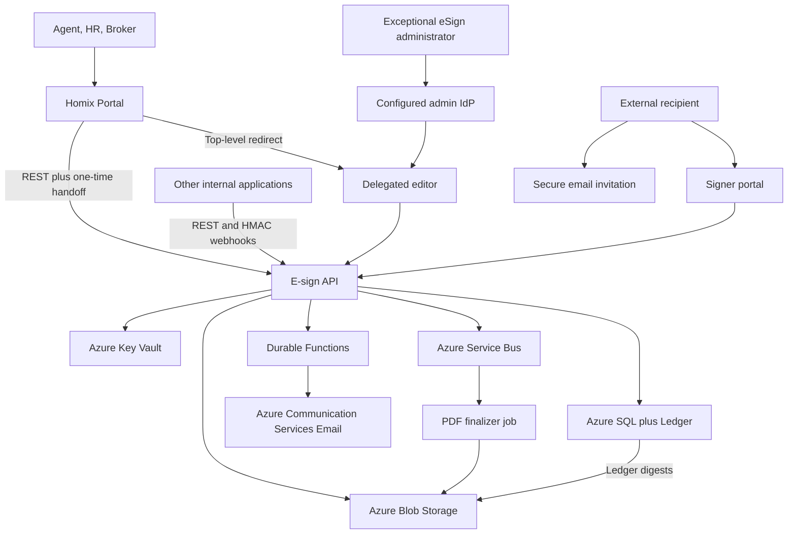

## Context

The workspace is a greenfield project. The platform will be shared by several internal applications but is not intended to become a public multi-tenant SaaS. Initial business coverage is licensed real-estate work in New York, New Jersey, and California plus ordinary US employee onboarding. External recipients are expected to be consumers who should not need an account and should normally complete signing from a mobile device after opening one invitation email.

The system handles legally consequential documents and HR personal information. Its defensibility depends on the entire evidence chain: recipient routing, intent and consent, immutable document versions, explicit signing actions, delivery records, reproducible completed files, retention, and operational controls. A signature image by itself is not treated as identity proof or sufficient evidence.

Primary stakeholders are platform administrators, workspace administrators, real-estate agents, brokers/approvers, HR preparers, organization countersigners, external signers, internal application owners, and future auditors or counsel. Broker/counsel owners must approve each jurisdiction pack and retention matrix before it is enabled in production.

## Goals / Non-Goals

**Goals:**

- Provide one central e-signature platform that current and future internal applications can call through stable APIs and webhooks.
- Let staff initiate work in Homix Portal and enter a mobile-responsive eSign preparation/editor surface without a second login.
- Give external recipients a one-email, one-click, accountless signing experience with an explicit electronic-record consent step.
- Support sequential/parallel signing, optional approval, multi-document packets, reminders, deadlines, declines, voids, and resumable sessions.
- Produce completed PDFs, completion certificates, cryptographic manifests, and a tamper-evident audit history suitable for business and regulatory review.
- Preserve completed real-estate packages for a default seven-year policy with per-document overrides and legal holds.
- Isolate workspaces and projects, minimize sensitive data, and operate with documented backup, recovery, monitoring, and key-rotation procedures.
- Deliver an initial vertical slice that can be piloted before broad template and project migration.

**Non-Goals:**

- Public signup, customer billing, marketplace forms, or external organizations administering their own subscription.
- Remote online notarization, deeds, mortgage closing, e-recording, digital certificate/PAdES assurance, or government identity proofing.
- I-9, W-4, tax filing, medical forms, KBA, biometric checks, or government-ID verification in the first release.
- Legal drafting, legal advice, or redistribution of forms beyond the organization's existing licenses.
- Word/Excel-to-PDF conversion, OCR field auto-detection, collaborative document editing, native mobile applications, or offline signing in the first release.
- Guaranteeing that a signer is a specific natural person when the selected assurance method is only control of an email invitation.

## Decisions

### 1. Azure is the system of record

The production system will use Azure rather than a pure Cloudflare stack. Azure Blob immutable storage provides granular time-based retention and legal hold, Azure SQL Ledger provides tamper-evident database history, Key Vault provides managed cryptographic key custody, and Container Apps provides a mature path for PDF tools that require an OS process or filesystem.

Cloudflare was considered for Workers, D1, R2, Durable Objects, and Workflows. It would reduce baseline cost and deployment complexity, but would require more custom evidence, key, transaction, PDF, and legal-hold behavior. A cross-cloud runtime was rejected for version one because it would add two control planes, duplicated observability, cross-cloud failure modes, and more difficult incident response. The domain may continue to use any DNS provider without making that provider part of the application architecture.

### 2. Use a modular monolith plus asynchronous workers

The initial codebase will be a TypeScript monorepo with clear domain modules rather than separately deployed microservices for every capability. Deployable units are:

- A React/TypeScript web application for staff and signer experiences.
- A Node.js/TypeScript API on Azure Container Apps.
- Durable Functions orchestrations for long-lived signing and reminder flows.
- A queue-triggered PDF finalizer implemented as a Container Apps Job.
- Infrastructure as code and operational scripts.

This preserves transactional clarity and developer velocity while isolating the CPU- and tooling-heavy PDF path. Modules communicate through application interfaces; deployable services communicate through versioned queue messages or HTTP contracts.

### 3. Azure service topology

Production data remains in a selected US Azure geography. Staging and production use separate subscriptions or, at minimum, separate resource groups, databases, storage accounts, Key Vaults, identities, domains, and application registrations. Production secrets are unavailable to pull-request environments.

### 4. Portal staff, administrators, machines, and recipients have separate access paths

- HR, agents, brokers, and managers authenticate in Homix Portal. Its backend creates an exact-return-URL, five-minute, one-time launch for a stable Portal actor; eSign exchanges it for a one-hour HttpOnly session protected by CSRF.
- Delegated authorization is the intersection of the actor's non-administrator role and the source application's scopes. Every resulting audit event records both identities.
- A standalone eSign administrator login is retained only for template governance, credential management, audit, and recovery. Google Workspace is preferred for this small group; the current Entra adapter remains replaceable until the deployment identity gate.
- Internal applications use scoped client credentials or hashed API keys with explicit workspace, environment, and operation scopes. Credentials are independently revocable and rotatable.
- External recipients do not create accounts. Their default assurance is a secure invitation sent to the assigned email address.
- An optional sender-provided access code is supported as an enhanced method. SMS, KBA, and government ID are deferred.

Authorization is deny-by-default. Every data query is scoped by workspace. Platform administrators may enter a support-access mode only with a reason, short expiration, and audit record.

### 5. Default recipient experience uses one invitation email

The default ceremony is: receive email, select **Review & Sign**, open the document, accept the electronic records/signature disclosure, complete assigned fields, adopt a signature, and select **Finish**. There is no second email OTP and no account registration.

The invitation uses a high-entropy opaque secret bound to one recipient and envelope. Only a hash is stored. A safe GET never changes state or consumes the invitation, preventing email scanners from invalidating it. The browser exchanges the invitation for an HttpOnly, Secure, SameSite session; mutating requests require CSRF protection and an active recipient session. Request URLs containing credentials are excluded or redacted from logs.

The invitation expires when the envelope expires, is revoked on recipient replacement or envelope void, and becomes non-mutating after completion. Reopening an incomplete invitation resumes the same recipient. The audit report accurately labels this as email-invitation possession rather than verified government identity.

### 6. Templates and documents are immutable versions

A template is a logical record with one or more immutable versions. Each version contains:

- Original licensed PDF object reference and SHA-256 digest.
- Jurisdiction, form name, source/license metadata, edition, effective date, and retirement state.
- Recipient role definitions and routing defaults.
- Normalized field schema and coordinates.
- Approval, authentication, evidence, and retention policy references.

Coordinates are stored as page-relative normalized values with page rotation and crop-box metadata. Rendering uses PDF.js; drag/drop and resizing use a maintained interaction library. Templates are previewed at multiple viewport sizes, but PDF coordinates remain independent of browser pixels.

Sending creates immutable envelope document versions. Any post-send content or field change requires a correction flow that voids or supersedes the prior envelope; it never silently changes the document already presented to a recipient.

### 7. Envelope state is explicit and transition guarded

Primary states are `DRAFT`, `PREPARED`, `APPROVAL_PENDING`, `READY_TO_SEND`, `SENT`, `IN_PROGRESS`, and `COMPLETED`. Terminal/side states are `DECLINED`, `VOIDED`, `EXPIRED`, and `FAILED_FINALIZATION`.

State transitions execute through one application service and an optimistic concurrency token. Commands are idempotent. Recipient completion is recorded only after all required fields for that recipient are validated. Envelope completion begins a durable finalization workflow and is not announced until the immutable evidence package has been committed successfully.

Recipients support signer, approver, countersigner, receives-copy, and view-only roles. Routing groups support parallel recipients within a step and sequential steps across groups.

### 8. Core data model

Principal tables include `workspaces`, `workspace_members`, `application_clients`, `templates`, `template_versions`, `template_documents`, `recipient_roles`, `template_fields`, `transactions`, `envelopes`, `envelope_documents`, `recipients`, `recipient_sessions`, `field_values`, `consent_records`, `signature_adoptions`, `audit_events`, `evidence_packages`, `retention_policies`, `legal_holds`, `webhook_subscriptions`, `webhook_deliveries`, and `email_deliveries`.

Mutable operational entities use standard Azure SQL tables with concurrency columns. Security- and evidence-relevant events use append-only ledger tables. Audit payloads are canonicalized, contain a previous-event hash, and exclude document contents or unnecessary secrets. Database ledger digests are written to immutable Blob storage and verified on a schedule.

### 9. Blob storage separates mutable and immutable lifecycles

Separate private containers or storage accounts are used for:

- Upload quarantine.
- Mutable drafts.
- Licensed template originals and versions.
- In-progress envelope snapshots.
- Completed PDFs.
- Evidence manifests, audit exports, certificates, and SQL ledger digests.
- Database exports and disaster-recovery material.

Completed and evidence objects receive a locked time-based immutability policy derived from the retention policy. Legal holds are separate from time retention. Drafts never inherit irreversible retention. Clients never receive public Blob URLs; authorized application endpoints issue short-lived user-delegation access or stream the object after authorization.

### 10. PDF finalization is deterministic and asynchronous

The PDF job receives an immutable finalization command containing object references and expected hashes, not unbounded raw PDFs on the queue. It validates source hashes, applies field appearances and signatures, flattens supported form fields, writes a human-readable completion certificate, computes output hashes, and creates a canonical evidence manifest.

The job writes to a temporary key, verifies that the output is readable and page counts are expected, then commits immutable final objects. Retries are safe because object keys and command identifiers are deterministic. Unsupported/encrypted/corrupt PDFs fail before sending when possible; a post-sign finalization failure enters `FAILED_FINALIZATION`, alerts operators, and never sends a false completion notice.

### 11. Evidence records facts without overstating assurance

The evidence package includes original documents, completed documents, a completion certificate, canonical manifest, audit JSONL, consent/disclosure version, email delivery events, recipient authentication method, explicit signature and finish timestamps, server-observed IP and user agent, and cryptographic hashes.

The Key Vault signing key signs the manifest. Key ID and algorithm are stored with the signature so historical evidence remains verifiable through rotation. The system does not claim that a typed or drawn signature image alone proves identity. Recipient actions and the exact document digest presented at each action are the binding evidence.

### 12. Real-estate behavior is a jurisdiction pack, not hard-coded forks

The core engine remains jurisdiction-neutral. NY, NJ, and CA packs provide enabled workflow types, party-role presets, disclosures, template metadata rules, broker approval defaults, deadline semantics, and retention mappings. A `transaction` groups related envelopes such as listing, offer, counteroffer, and amendment without altering completed documents.

The default real-estate retention policy is seven years to cover the longest identified initial state requirement plus operational margin, subject to broker/counsel approval. Jurisdiction and form-edition metadata are mandatory on production templates. Retired template versions remain readable for historical packages but cannot create new envelopes.

### 13. HR uses the same engine with stricter data minimization

HR packets may contain multiple ordinary documents with employee and employer roles, prefilled data, employee-entered fields, attachments, and countersignature. Retention is selected per document class rather than inheriting the real-estate seven-year policy.

I-9, W-4, medical information, benefits enrollment, and other specialized regulated workflows are blocked from being labeled as supported templates in version one. Sensitive input types are masked in UI, omitted from telemetry, and encrypted at the application layer if later enabled. Completed sensitive HR packages default to secure download links rather than email attachments.

### 14. Portal-first integration uses one-time top-level redirects, not embedded iframes

Version-one integrations create transactions and envelopes through `/v1`. When a user needs PDF field placement or an eSign preparation screen, the source backend creates `/v1/portal-sessions` with its application credential, actor identity, intent, and an exact registered return URL. The returned ticket lives in the URL fragment, is exchanged once by POST, and never enters ordinary HTTP request logs. Signer links are sent by the e-sign platform. Iframes and client SDKs remain deferred until the redirect model is stable.

Every write supports an idempotency key where repeat submission is plausible. Webhooks use an HMAC signature over timestamp plus raw body, include a unique event ID, reject stale replay attempts at consumers, retry with exponential backoff, and enter a dead-letter state after the configured limit. API and event schemas are versioned independently of internal database models.

### 15. Security and privacy are release gates

- All storage and service communication use TLS; storage encryption at rest is enabled and sensitive signing keys live in Key Vault.
- Managed identities replace connection strings where Azure services support them.
- Uploads are size-limited, MIME-checked, structurally parsed, malware-scanned, and kept in quarantine until accepted.
- PDF fetch/import from arbitrary URLs is not supported, avoiding an SSRF surface.
- Content Security Policy, frame controls, CSRF defenses, secure cookies, rate limits, anti-automation controls, and strict CORS are required.
- No access token, signature mark, PDF field value, SSN, bank value, or document body appears in logs.
- Privileged and support actions are audited; production access uses least privilege and just-in-time elevation.
- Dependency scanning, secret scanning, IaC policy checks, SAST, and signed build artifacts run in CI.

### 16. Observability, recovery, and operational ownership

Application Insights records request and workflow metrics using IDs and states rather than document content. Alerts cover send failure, email bounce, queue backlog, finalization failure, webhook dead letters, SQL/Blob availability, Key Vault errors, ledger verification failure, and abnormal token attempts.

Runbooks define recipient replacement, resend, envelope void, failed PDF recovery, webhook replay, key rotation, legal hold, data export, restore verification, and security incident response. Backups are periodically restored into an isolated environment. Initial targets are RPO of 24 hours for non-evidence operational metadata and zero acknowledged loss for completed immutable evidence; RTO is one business day during pilot and is tightened before broad production use.

## Risks / Trade-offs

- [Email access does not prove natural-person identity] → Label assurance accurately, make access-code authentication selectable, and allow future phone/ID providers without changing the envelope model.
- [Forwarded links or shared family inboxes permit another person to act] → Use recipient-specific links, record mailbox-level assurance, warn senders when the same email is assigned to multiple signers, and offer stronger authentication when required.
- [Email security scanners open links] → Keep GET side-effect-free, never consume on view, require browser/session and POST for all mutations, and redact credential-bearing paths.
- [Licensed form rights vary] → Require source/license metadata, private workspaces, export controls, and an owner attestation before publishing a template.
- [PDFs differ in crop boxes, rotation, AcroForms, fonts, and encryption] → Normalize on upload, maintain a compatibility test corpus, reject unsupported inputs before sending, and isolate PDF tooling in a container job.
- [Locked retention prevents correcting operational mistakes] → Apply WORM only after verified completion, use short mutable staging objects, separate retention classes, and test policies in non-production before locking.
- [Azure has higher baseline cost and more services than Cloudflare] → Use scale-to-zero compute, budget alerts, a modular monolith, and staged enabling of optional services; do not trade away evidence controls for minor savings.
- [Azure SQL Ledger increases schema and migration constraints] → Limit ledger use to audit/evidence tables, test every migration against restored production-like data, and export/verify digests automatically.
- [A finalization failure occurs after all signers finish] → Make finalization an explicit state, alert immediately, keep all signed field events, use deterministic retries, and communicate completion only after evidence commit.
- [Jurisdiction or employment requirements change] → Version policy packs and disclosures, track effective/retirement dates, and require reapproval without rewriting historical envelopes.
- [Internal application webhook consumers fail] → Persist every delivery, retry, expose controlled replay, document idempotency, and provide polling as recovery.
- [Sensitive HR information leaks through telemetry or email attachments] → Data classification, log redaction tests, secure links by default, document-specific retention, and release-time privacy review.

## Migration Plan

1. Establish the monorepo, CI quality gates, IaC foundation, separate non-production resources, custom domains, administrator identity provider, and verified email domain.
2. Implement workspace access, template upload, PDF rendering, and versioned drag/drop authoring using synthetic documents only.
3. Implement the envelope lifecycle and one-email signer ceremony without immutable retention; validate scanner behavior and mobile accessibility.
4. Add PDF finalization, completion certificates, audit ledger, Key Vault manifest signing, Blob immutability, and scheduled ledger verification.
5. Add REST API, scoped clients, webhook signing/retries, and a reference integration harness.
6. Configure one reviewed real-estate template per state and one ordinary HR packet; run internal test envelopes with no production PII.
7. Conduct threat modeling, accessibility review, PDF compatibility testing, disaster-recovery restore, broker/counsel review, and privacy approval.
8. Pilot with a small internal group and low-risk documents. Monitor completion, bounce, support, and finalization metrics.
9. Enable additional licensed forms and source applications in controlled batches.

Rollback is deployment-based for application code and schema-forward for databases. A broken release is rolled back to the previous Container Apps revision. Database changes must be backward compatible until the prior application revision is retired. Immutable completed evidence is never rolled back or deleted; corrections create a new envelope linked to the superseded one.

## Open Questions

- Final production brand, hostname, sending domain, sender display name, and support contact.
- Named broker/counsel approver for the NY, NJ, and CA packs and the final seven-year real-estate retention policy.
- Exact initial HR document list and per-document retention owners.
- Final Homix Portal production and staging return URLs and stable user-subject format.
- Whether completed non-sensitive real-estate PDFs are attached to email or always delivered through secure download links.
- Pilot RTO/RPO acceptance and whether a second Azure region is required before, or after, general availability.
